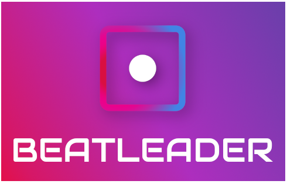

# BeatLeader Quest Mod

Oculus Quest native mod for the BeatLeader.

Beat Saber custom songs leaderboard service. It records your plays and sends them to the server.

## Usage

Download .qmod file from the [Releases](/releases) tab and install it using BMBF. Use the appropriate version for your Beat Saber version!
In order to see leaderboards and post scores, you need to login into your Oculus account in preferences. You may create a new account if you forgot your password, but avatar and other oculus things will not synchronize.

Go to the https://agitated-ptolemy-7d772c.netlify.app/ to see your scores on the web.

## Roadmap

- Replay synchronization
- Profile viewer
- Score statistic viewer
- In-game replay player
- Friends management
- Playlist management and synchronization

## Credits

* [zoller27osu](https://github.com/zoller27osu), [Sc2ad](https://github.com/Sc2ad) and [jakibaki](https://github.com/jakibaki) - [beatsaber-hook](https://github.com/sc2ad/beatsaber-hook)
* [raftario](https://github.com/raftario)
* [Lauriethefish](https://github.com/Lauriethefish), [danrouse](https://github.com/danrouse) and [Bobby Shmurner](https://github.com/BobbyShmurner) for [this template](https://github.com/Lauriethefish/quest-mod-template)
